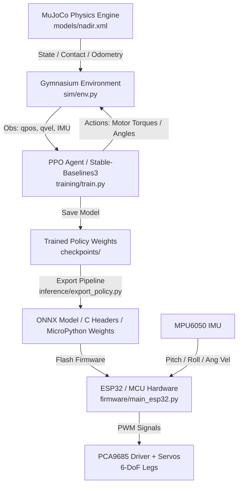

# Nadir: Autonomous Bipedal Walker Robot 🦿🤖

[](LICENSE)
[](https://www.python.org/downloads/)
[](https://mujoco.org/)
[](https://gymnasium.farama.org/)
[](https://stable-baselines3.readthedocs.io/)

**Nadir** is an end-to-end open-source bipedal locomotion robotics platform. It combines physics-accurate **MuJoCo** simulation, deep reinforcement learning via **Proximal Policy Optimization (PPO)**, dynamic gait generation, and embedded **ESP32 / MicroPython** firmware for sim-to-real physical deployment.

---

## 📑 Table of Contents

- [Overview & Philosophy](#overview--philosophy)
- [System Architecture](#system-architecture)
- [Robot Physical Specifications](#robot-physical-specifications)
- [Repository Structure](#repository-structure)
- [Installation](#installation)
- [Simulation & Environment](#simulation--environment)
- [Reinforcement Learning & Training](#reinforcement-learning--training)
- [Evaluation & Visualization](#evaluation--visualization)
- [Policy Export & Embedded Deployment](#policy-export--embedded-deployment)
- [Hardware & Electronics](#hardware--electronics)
- [Sim-to-Real Transfer](#sim-to-real-transfer)
- [Roadmap](#roadmap)
- [Contributing](#contributing)
- [License](#license)

---

## 🎯 Overview & Philosophy

The project name **Nadir** refers to the lowest point in a celestial sphere—representing the initial grounded state from which dynamic bipedal balance is learned and elevated.

### Key Highlights:
- **Physics Simulation**: Custom 6-DoF planar bipedal model built in MuJoCo with realistic joint limits, friction, and actuator damping.
- **Deep RL Pipeline**: Parallelized PPO training leveraging multi-core CPU vectorization (e.g. 16–24 parallel environments).
- **Embedded Firmware**: Real-time ESP32 / Arduino controller firmware with PCA9685 16-channel PWM servo multiplexing and MPU6050 / BNO055 IMU state estimation.
- **Export Pipelines**: Neural network policy export to ONNX and lightweight C/MicroPython evaluation arrays for direct microcontroller deployment.

---

## 🏗️ System Architecture



---

## 📐 Robot Physical Specifications

| Parameter | Specification |
| :--- | :--- |
| **Total Degrees of Freedom (DoF)** | 6 (3 per leg: Hip Hinge, Knee Hinge, Ankle Hinge) |
| **Leg Length** | Thigh: 400 mm \| Shank: 400 mm \| Foot: 200 mm |
| **Total Height (Standing)** | 1.25 m (simulation baseline) / Scalable |
| **Joint Limits** | Hip: $-150^\circ \text{ to } 0^\circ$ \| Knee: $-150^\circ \text{ to } 0^\circ$ \| Ankle: $-45^\circ \text{ to } +45^\circ$ |
| **Actuators** | High-torque digital metal gear servos (or simulated torque motors) |
| **Primary Compute** | ESP32-S3 (Physical) / Host PC (Simulation & Training) |
| **Sensors** | 6-Axis IMU (MPU6050/BNO055), Joint Encoders/Potentiometers, Foot Contact Switches |
| **Power System** | 2S/3S LiPo (7.4V - 11.1V) with 5V/6V 10A UBEC step-down |

---

## 📂 Repository Structure

```
Nadir/
├── .github/
│   └── workflows/
│       └── ci.yml                 # Automated CI test suite
├── checkpoints/                   # Trained model weights (.zip / .onnx)
│   └── pretrained_ppo_walker.zip
├── docs/                          # Detailed engineering documentation
│   ├── kinematics.md              # Forward & Inverse Kinematics derivation
│   ├── rl_formulation.md          # MDP, state/action spaces, reward shaping
│   └── sim_to_real.md             # Domain randomization & latency compensation
├── firmware/                      # Microcontroller / Embedded code
│   ├── imu_filter.py              # Complementary/Madgwick orientation filter
│   ├── main_esp32.py              # Main real-time execution loop for ESP32
│   └── servo_driver.py           # PCA9685 16-channel PWM servo interface
├── hardware/                      # Mechanical & electrical design specs
│   ├── BOM.md                     # Complete Bill of Materials
│   └── wiring_guide.md            # Pinout tables and circuit schematics
├── inference/                     # Evaluation, visualization, and export tools
│   ├── export_policy.py           # ONNX and embedded C/Python weight exporter
│   └── visualize.py               # Interactive real-time MuJoCo renderer
├── models/                        # Physics and CAD definitions
│   └── nadir.xml                  # MuJoCo XML kinematic & dynamic model
├── sim/                           # Custom Gymnasium environment
│   ├── __init__.py
│   └── env.py                     # Nadir Gymnasium environment
├── training/                      # Training scripts and configs
│   ├── config.yaml                # Hyperparameter definitions
│   ├── evaluate.py                # Policy evaluation and metrics benchmark
│   └── train.py                   # Multi-core vectorized PPO training script
├── .gitignore
├── CONTRIBUTING.md
├── LICENSE
├── pyproject.toml
└── requirements.txt
```

---

## ⚡ Installation

### 1. Clone the Repository
```bash
git clone https://github.com/your-username/Nadir.git
cd Nadir
```

### 2. Set Up Python Virtual Environment
```bash
python -m venv .venv

# On Windows:
.venv\Scripts\activate

# On Linux / macOS:
source .venv/bin/activate
```

### 3. Install Dependencies
```bash
pip install --upgrade pip
pip install -r requirements.txt
```

---

## 🔬 Simulation & Environment

The environment `NadirBipedalWalker-v0` wraps MuJoCo using Gymnasium.

- **Observation Space ($17$ dims)**:
  - Root torso height ($z$), pitch angle ($\theta$), forward/vertical velocities ($\dot{x}, \dot{z}$), angular velocity ($\dot{\theta}$)
  - Joint positions ($q_1 \dots q_6$) for left and right hips, knees, and ankles
  - Joint velocities ($\dot{q}_1 \dots \dot{q}_6$)
- **Action Space ($6$ continuous dims)**:
  - Actuator target control signals in range $[-1.0, +1.0]$ mapped to motor torques/positions.
- **Reward Function**:
  $$R_t = v_{\text{forward}} - c_{\text{ctrl}} \cdot \|\mathbf{a}\|^2 + r_{\text{alive}} - p_{\text{fall}}$$

To test the environment loading:
```bash
python -c "import sim.env; print('Nadir environment loaded successfully!')"
```

---

## 🏋️ Reinforcement Learning & Training

Train the walker using multi-core vectorized PPO:

```bash
python training/train.py --timesteps 10000000 --num-envs 16
```

Key features:
- Automatically utilizes all available CPU logical cores via `SubprocVecEnv`.
- Logs training progress, entropy, value loss, and policy loss to TensorBoard.
- Periodically saves model checkpoints in `checkpoints/`.

View training metrics in TensorBoard:
```bash
tensorboard --logdir ./tensorboard_logs/
```

---

## 👁️ Evaluation & Visualization

Watch the trained bipedal walker walk in real-time with physics rendering:

```bash
python inference/visualize.py --model checkpoints/pretrained_ppo_walker.zip
```

Run comprehensive benchmark evaluation:
```bash
python training/evaluate.py --model checkpoints/pretrained_ppo_walker.zip --episodes 20
```

---

## 🚀 Policy Export & Embedded Deployment

Export the trained policy to ONNX format or raw weights for low-power microcontrollers:

```bash
python inference/export_policy.py --model checkpoints/pretrained_ppo_walker.zip --output-dir exported_models/
```

This generates:
1. `nadir_policy.onnx` (for Edge AI runtimes / TensorRT / ONNX Runtime)
2. `nadir_weights.h` (C header for bare-metal Arduino / STM32)
3. `nadir_weights.py` (MicroPython compatible matrix weights for ESP32)

---

## 🔌 Hardware & Electronics

See detailed guides in `hardware/`:
- [Bill of Materials (BOM)](hardware/BOM.md)
- [Wiring & Pinout Guide](hardware/wiring_guide.md)

### Microcontroller Pinout (ESP32-S3):
- `GPIO 21` $\rightarrow$ I2C SDA (PCA9685 Servo Driver + MPU6050 IMU)
- `GPIO 22` $\rightarrow$ I2C SCL (PCA9685 Servo Driver + MPU6050 IMU)
- `GPIO 18 / 19` $\rightarrow$ Left / Right Foot contact microswitches

---

## 🗺️ Sim-to-Real Transfer

Deploying policies from MuJoCo to real hardware requires handling dynamics discrepancies. Nadir implements:
1. **Domain Randomization**: Mass, friction, damping, and sensor noise variation during training.
2. **Actuator Delay Modeling**: Artificial 20–40 ms latency buffer in observation-action cycle.
3. **IMU Sensor Fusion**: Madgwick/Complementary filter running at 100 Hz on ESP32.

Read more in [docs/sim_to_real.md](docs/sim_to_real.md).

---

## 🗺️ Roadmap

- [x] MuJoCo 6-DoF planar biped kinematics model
- [x] Gymnasium environment with continuous action spaces
- [x] PPO training pipeline with multi-core parallelism
- [x] Real-time 3D visualization viewer
- [x] Policy export to ONNX & MicroPython
- [x] ESP32 MicroPython firmware skeleton
- [ ] 3D CAD step files for 3D-printable leg chassis
- [ ] 3D Walker (12-DoF with lateral roll and yaw hip abduction)
- [ ] Vision-guided terrain traversal with depth camera / LiDAR

---

## 🤝 Contributing

Contributions are welcome! Please check out [CONTRIBUTING.md](CONTRIBUTING.md) for guidelines on code style, testing, and pull requests.

---

## 📄 License

This project is open-source software licensed under the [MIT License](LICENSE).
