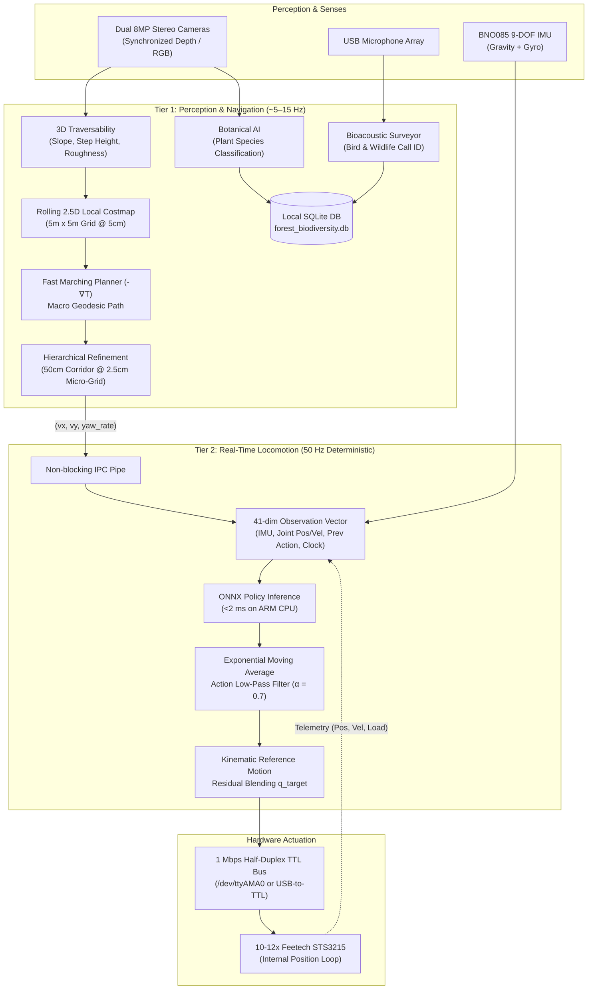

# Nadir — Autonomous Bipedal Robot for Forest Biodiversity Mapping

[](LICENSE)
[](https://www.python.org/)
[](https://github.com/google-deepmind/mujoco)
[](https://onnxruntime.ai/)

**Nadir** is a desktop-scale (~35 cm tall, ~1.5 kg) autonomous bipedal robot designed on an accessible student budget of approximately **£700**. 

Engineered specifically for **rough-terrain forest exploration and ecological biodiversity monitoring**, Nadir navigates GPS-denied forest floors (moss, roots, leaf litter, stepped obstacles) while autonomously mapping plant species and surveying wildlife audio in real time.

> **Project Origin & Philosophy:** Rather than reinventing the bipedal locomotion stack from scratch, Nadir builds on proven sim-to-real principles, pairing a 50 Hz Reinforcement Learning balance loop with edge spatial AI.

---

## 📂 Repository Structure

This repo is organized into **6 sections** following the full pipeline from hardware design through to real-world deployment:

```
nadir/
│
├── 1. README.md                ← You are here
│
├── 2. hardware/                ← Hardware & CAD 3D Models
│   ├── Arduino_UNO_Q.SLDPRT    # SolidWorks CAD model for Uno Q compute
│   ├── arduino_uno_q_housing*  # Enclosure & mounting clamp parts
│   ├── head.SLDPRT             # Stereo camera & sensor head mount
│   └── servo STS3215.SLDPRT    # Feetech actuator CAD reference
│
├── 3. software/                ← Software (ML, Perception, Navigation, Biodiversity)
│   ├── training/               # PPO reinforcement learning pipeline (JAX/Flax)
│   ├── vision/                 # Depth perception & visual encoding (Dual 8MP Stereo)
│   ├── navigation/             # 2.5D costmap, FMM planner, micro-corridor refinement
│   ├── biodiversity/           # Edge AI: plant classification & bioacoustic surveying
│   ├── scripts/                # Benchmarks, SLURM launcher
│   └── tests/                  # Automated test suite
│
├── 4. simulation/              ← Digital Twin Simulation (MuJoCo/MJX)
│   ├── env_mjx.py              # Vectorized JAX environment (4,096 parallel robots)
│   ├── rewards.py              # Shaped rewards (jerk penalty, inertia, soft impact)
│   ├── reference_motion.py     # Kinematic gait reference trajectory
│   └── visualize_sim.py        # Interactive 3D MuJoCo viewer
│
├── 5. sim_to_real/             ← Sim-to-Real Transfer (Staged workspace)
│
└── 6. real/                    ← Embedded Deployment (Staged workspace)
```

---

## 🌲 The Mission: Forest Biodiversity Mapping

Under dense forest canopies, standard wheeled rovers get stuck on roots, and GPS signals degrade. Nadir uses a two-tier perception and locomotion architecture to act as an autonomous ecological survey scout:

* **Botanical Species AI (`software/biodiversity/plant_classifier.py`):** Captures RGB frames of the forest undergrowth, running lightweight ONNX vision models in background threads to classify local flora, mushrooms, and invasive weeds.
* **Bioacoustic Wildlife Surveying (`software/biodiversity/bioacoustics.py`):** Samples a 3-second sliding audio window from an onboard microphone array, analyzing log-mel spectrograms with ONNX audio networks (BirdNET/YAMNet) to detect bird calls and amphibian activity.
* **GPS-Denied 3D Spatial Tagging (`software/biodiversity/logger.py`):** Every ecological detection is automatically logged with its exact local 3D coordinates $(X, Y, Z)$ and timestamp into an onboard SQLite database (`forest_biodiversity.db`).

---

## 🏛️ System Architecture

Nadir strictly decouples **high-frequency dynamic balance** from **asynchronous high-level perception and planning**. Perception spikes or delayed image frames can never preempt or freeze the 50 Hz balance loop.



---

## ⚙️ Hardware Specifications & Bill of Materials

| Subsystem | Component | Specifications & Engineering Rationale |
| :--- | :--- | :--- |
| **Compute** | **Arduino Uno Q 4GB** / Linux ARM64 SBC | Quad-core ARM processor, 4 GB RAM. Runs headless Linux, ONNX Runtime C++ engine, and background Edge AI pipelines. |
| **Actuators** | **10–12× Feetech STS3215** | Half-duplex TTL serial bus daisy-chained @ 1 Mbps. 12-bit magnetic encoders. **Strict Position Control** (internal PD loop). Torque stall: 2.94 N·m @ 7.4 V. |
| **IMU** | **BNO085** | High-precision orientation sensor providing projected gravity vectors and 3D angular velocities at >100 Hz. |
| **Vision** | **Dual 8MP Stereo Cameras (2× 8MP)** | Synchronized stereo camera pair for depth disparity estimation and high-resolution botanical survey capture. |
| **Audio** | **USB Microphone Array** | High-sensitivity omnidirectional condenser mic for bioacoustic bird/wildlife audio classification. |
| **Power** | **2S LiPo (7.4 V, 3500 mAh, 110C)** | Direct high-current connection to servo bus (no regulator brownouts). Dedicated **5 V / 5 A UBEC** for clean logic power. |
| **Frame** | **Self-Manufactured PETG** | 3D-printed PETG linkages, brass heat-set threaded inserts (M3), and F623ZZ flanged bearings at all rotational joints. |

---

## 🏃 Sim-to-Real & Walking Smoothness Discipline

Sim-to-real transfer fails when simulations assume ideal, frictionless motors or instantaneous torque responses. Nadir enforces 5 non-negotiable engineering principles in simulation and runtime:

1. **Strict Position Control:** The Feetech STS3215 closes its own position loop internally. MuJoCo simulation uses `<position>` actuators (never `<motor>`).
2. **Onboard Action Low-Pass Filtering:** An Exponential Moving Average (EMA) filter ($\alpha = 0.7$) eliminates 50 Hz micro-tremors and motor chatter.
3. **Action Jerk Penalty ($2^{\text{nd}}$ Derivative):** `simulation/rewards.py` penalizes sudden changes in joint acceleration ($\|a_t - 2a_{t-1} + a_{t-2}\|^2$) forcing the policy to learn smooth S-curve movements.
4. **Torso Inertial Stabilization:** Penalizes torso angular acceleration ($\|\dot{\omega}_{\text{base}}\|^2$) and linear jerk, eliminating body pitch flapping and providing a stable camera horizon.
5. **Soft Ground Impact & Joint Compliance:** Soft foot-touchdown penalties prevent chassis vibration, while ankle joints use compliant gain overrides ($K_p = 12.0$) to absorb ground shocks.

---

## 🚀 Getting Started

### 1. Environment Setup

Clone the repository:
```bash
git clone https://github.com/teddyprendergast-pixel/Nadir.git
cd Nadir
```

Create a virtual environment and install dependencies:
```bash
python -m venv .venv
source .venv/bin/activate  # On Windows: .venv\Scripts\activate
pip install -r requirements.txt
```

### 2. Benchmark Simulation Throughput

```bash
python software/scripts/benchmark_envs.py
```

### 3. Train Locomotion Policy (MJX / JAX)

Train the asymmetric actor-critic policy across 4,096 parallel simulated robots:
```bash
python -m software.training.train --num-envs 4096 --total-timesteps 100000000
```

### 4. Visualize in Simulation

```bash
python simulation/visualize_sim.py --policy models/nadir_policy.onnx
```

### 5. Deploy Onboard (Arduino Uno Q 4GB)

The physical robot runs a deterministic 50 Hz control loop on the Arduino Uno Q interfacing with the onboard IMU and 1 Mbps TTL servo bus (configured via `real/`).

---

## 📄 License

This project is open-source under the [MIT License](LICENSE).
