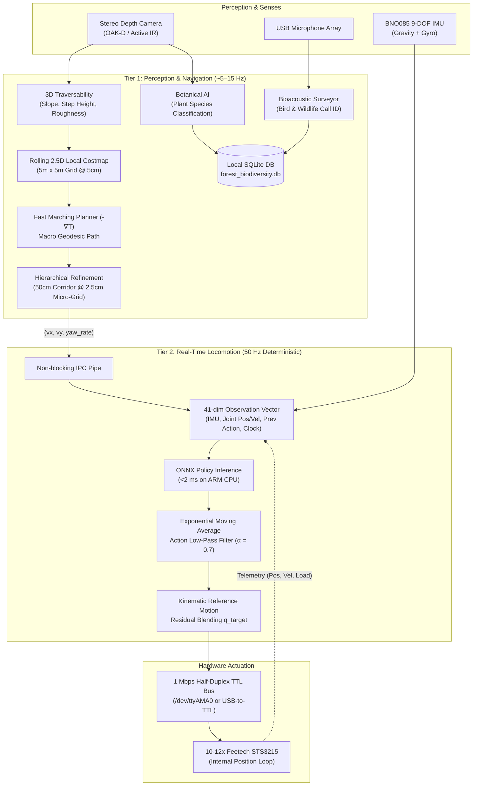

# Nadir — Autonomous Bipedal Robot for Forest Biodiversity Mapping

[](LICENSE)
[](https://www.python.org/)
[](https://github.com/google-deepmind/mujoco)
[](https://onnxruntime.ai/)

**Nadir** is a desktop-scale (~35 cm tall, ~1.5 kg) autonomous bipedal robot designed on an accessible student budget of approximately **£700 / €700**. 

Engineered specifically for **rough-terrain forest exploration and ecological biodiversity monitoring**, Nadir navigates GPS-denied forest floors (moss, roots, leaf litter, stepped obstacles) while autonomously mapping plant species and surveying wildlife audio in real time.

> **Project Origin & Philosophy:** Rather than reinventing the bipedal locomotion stack from scratch, Nadir builds on proven sim-to-real principles, pairing a 50 Hz Reinforcement Learning balance loop with edge spatial AI.

---

## 🌲 The Mission: Forest Biodiversity Mapping

Under dense forest canopies, standard wheeled rovers get stuck on roots, and GPS signals degrade. Nadir uses a two-tier perception and locomotion architecture to act as an autonomous ecological survey scout:

* **Botanical Species AI (`nadir/biodiversity/plant_classifier.py`):** Captures RGB frames of the forest undergrowth, running lightweight ONNX vision models in background threads to classify local flora, mushrooms, and invasive weeds.
* **Bioacoustic Wildlife Surveying (`nadir/biodiversity/bioacoustics.py`):** Samples a 3-second sliding audio window from an onboard microphone array, analyzing log-mel spectrograms with ONNX audio networks (BirdNET/YAMNet) to detect bird calls and amphibian activity.
* **GPS-Denied 3D Spatial Tagging (`nadir/biodiversity/logger.py`):** Every ecological detection is automatically logged with its exact local 3D coordinates $(X, Y, Z)$ and timestamp into an onboard SQLite database (`forest_biodiversity.db`).

---

## 🏛️ System Architecture

Nadir strictly decouples **high-frequency dynamic balance** from **asynchronous high-level perception and planning**. Perception spikes or delayed image frames can never preempt or freeze the 50 Hz balance loop.



---

## 🧭 Hierarchical Pathfinding & Micro-Corridor Refinement (2.5 cm Grid)

Navigating forest floors requires two distinct spatial resolutions: macro-scale path planning around big trees, and micro-scale foothold planning to avoid landing feet on sharp roots. Nadir uses a **Hierarchical Coarse-to-Fine Pipeline** (`nadir/navigation/corridor_refinement.py`):

1. **Macro-Planning Layer (5 cm Grid across 5m × 5m):**
   * Computes a global continuous arrival time field $T(x, y)$ using the Fast Marching Method (solving the Eikonal PDE).
   * Generates a smooth, geodesic walking trajectory avoiding trees, boulders, and steep cliffs.

2. **Micro-Corridor Refinement Layer (2.5 cm Grid along 50 cm Corridor):**
   * Rather than wastefully expanding the entire $5\text{ m} \times 5\text{ m}$ map to 2.5 cm (which would create 40,000 cells), Nadir extracts a narrow **50 cm wide corridor** surrounding the immediate 1.5-meter path.
   * At **2.5 cm resolution**, Nadir's ~7 cm × 4 cm foot spans a patch of $3 \times 2$ cells (6 discrete height points).
   * **Foothold Stability Scoring:** Evaluates micro-step height variance and contact plane roughness. If a step target lands on a sharp root edge (instability > 0.4), the refiner applies a subtle micro-steering nudge ($\pm 2.5\text{ cm}$) to land on an adjacent flat micro-pocket.
   * **Compute Efficiency:** Evaluating the 2.5 cm corridor takes **<1 ms** on the Arduino Uno Q 4GB CPU.

---

## ⚙️ Hardware Specifications & Bill of Materials

| Subsystem | Component | Specifications & Engineering Rationale |
| :--- | :--- | :--- |
| **Compute** | **Arduino Uno Q 4GB** / Linux ARM64 SBC | Quad-core ARM processor, 4 GB RAM. Runs headless Linux, ONNX Runtime C++ engine, and background Edge AI pipelines. |
| **Actuators** | **10–12× Feetech STS3215** | Half-duplex TTL serial bus daisy-chained @ 1 Mbps. 12-bit magnetic encoders. **Strict Position Control** (internal PD loop). Torque stall: 2.94 N·m @ 7.4 V. |
| **IMU** | **BNO085** | High-precision orientation sensor providing projected gravity vectors and 3D angular velocities at >100 Hz. |
| **Vision** | **Luxonis OAK-D Pro / Lite** | Active IR dot projector, stereo depth, and onboard Myriad X / RVC2 VPU for offloading disparity calculation. |
| **Audio** | **USB Microphone Array** | High-sensitivity omnidirectional condenser mic for bioacoustic bird/wildlife audio classification. |
| **Power** | **2S LiPo (7.4 V, 3500 mAh, 110C)** | Direct high-current connection to servo bus (no regulator brownouts). Dedicated **5 V / 5 A UBEC** for clean logic power. |
| **Frame** | **Self-Manufactured PETG** | 3D-printed PETG linkages, brass heat-set threaded inserts (M3), and F623ZZ flanged bearings at all rotational joints. |

---

## 🏃 Sim-to-Real & Walking Smoothness Discipline

Sim-to-real transfer fails when simulations assume ideal, frictionless motors or instantaneous torque responses. Nadir enforces 5 non-negotiable engineering principles in simulation and runtime:

1. **Strict Position Control:** The Feetech STS3215 closes its own position loop internally. MuJoCo simulation uses `<position>` actuators (never `<motor>`).
2. **Onboard Action Low-Pass Filtering:** An Exponential Moving Average (EMA) filter ($\alpha = 0.7$) runs inside `nadir/deploy/onnx_infer.py` to eliminate 50 Hz micro-tremors and motor chatter.
3. **Action Jerk Penalty ($2^{\text{nd}}$ Derivative):** `nadir/sim/rewards.py` penalizes sudden changes in joint acceleration ($\|a_t - 2a_{t-1} + a_{t-2}\|^2$) forcing the policy to learn smooth S-curve movements.
4. **Torso Inertial Stabilization:** Penalizes torso angular acceleration ($\|\dot{\omega}_{\text{base}}\|^2$) and linear jerk, eliminating body pitch flapping and providing a stable camera horizon.
5. **Soft Ground Impact & Joint Compliance:** Soft foot-touchdown penalties prevent chassis vibration, while ankle joints use compliant gain overrides ($K_p = 12.0$) configured in `hardware/measured/actuators.yaml` to absorb ground shocks.

---

## 📂 Repository Structure

```
nadir/
├── nadir/
│   ├── biodiversity/           # Edge AI for Forest Ecological Surveying
│   │   ├── bioacoustics.py     # Real-time wildlife & bird audio classifier
│   │   ├── plant_classifier.py # Botanical flora vision classifier
│   │   └── logger.py           # SQLite 3D geotagged biodiversity database
│   ├── deploy/                 # Onboard Embedded Deployment (4GB Linux SBC)
│   │   ├── control_loop.py     # Deterministic 50 Hz real-time control loop
│   │   ├── onnx_infer.py       # Optimized ONNX Runtime engine with EMA filter
│   │   ├── servo_bus.py        # Feetech STS3215 half-duplex serial driver
│   │   └── imu.py              # BNO085 / BNO055 driver interfaces
│   ├── navigation/             # Asynchronous Global & Local Navigation
│   │   ├── costmap.py          # 2.5D rolling 5m x 5m local terrain grid
│   │   ├── planner.py          # Fast Marching Method (FMM) & gradient descent
│   │   └── corridor_refinement.py # 2.5cm micro-grid foothold contact refiner
│   ├── sim/                    # MuJoCo MJX (JAX) Parallel Simulation
│   │   ├── env_mjx.py          # Vectorized JAX environment (4,096 parallel robots)
│   │   ├── rewards.py          # Shaped reward formulation (jerk, inertia, impact)
│   │   └── reference_motion.py # Kinematic gait reference generator
│   └── training/               # Reinforcement Learning (PPO) Training Stack
│       ├── ppo.py              # JAX-native PPO trainer with Generalized Advantage Estimation
│       ├── networks.py         # Asymmetric Actor-Critic Flax network architecture
│       └── train.py            # Primary cluster training script
├── docs/                       # Technical Documentation & Engineering Reports
│   └── audit-2026-08-21.md     # Audit report: Discarding invalid AI scaffolding
├── hardware/
│   └── measured/               # Single Source of Truth for Physical System-ID
│       ├── actuators.yaml      # Measured servo PD gains, backlash, and bus latency
│       └── README.md
├── scripts/
│   ├── benchmark_envs.py       # Hardware benchmark testing Steps Per Second (SPS)
│   └── visualize_sim.py        # Interactive MuJoCo passive viewer
└── README.md
```

---

## 🚀 Getting Started

### 1. Environment Setup

Clone the repository:
```bash
git clone https://github.com/teddyprendergast-pixel/Nadir.git
cd Nadir
```

Create a virtual environment and install dependencies:
```bash
python -m venv .venv
source .venv/bin/activate  # On Windows: .venv\Scripts\activate
pip install -r requirements.txt
```

### 2. Benchmark Simulation Throughput on Your Hardware

To determine the optimal parallel environment count (`--num-envs`) and maximum Steps Per Second (SPS) for your CPU/GPU:
```bash
python scripts/benchmark_envs.py
```

### 3. Train Locomotion Policy (MJX / JAX)

Train the asymmetric actor-critic policy across 4,096 parallel simulated robots:
```bash
python -m nadir.training.train --num-envs 4096 --total-timesteps 100000000
```

### 4. Deploy Onboard (Arduino Uno Q 4GB)

Run the deterministic 50 Hz control loop on the physical robot:
```bash
python -m nadir.deploy.control_loop --policy models/nadir_policy.onnx --port /dev/ttyAMA0 --imu bno085
```

---

## 📜 Engineering Audit Log

Transparency in engineering decisions is paramount. See [docs/audit-2026-08-21.md](docs/audit-2026-08-21.md) for a technical post-mortem detailing how an initial AI-generated scaffold (which erroneously assumed a 11.4 kg planar torque-controlled robot) was detected, audited, and replaced with physical reality.

---

## 📄 License

This project is open-source under the [MIT License](LICENSE).

